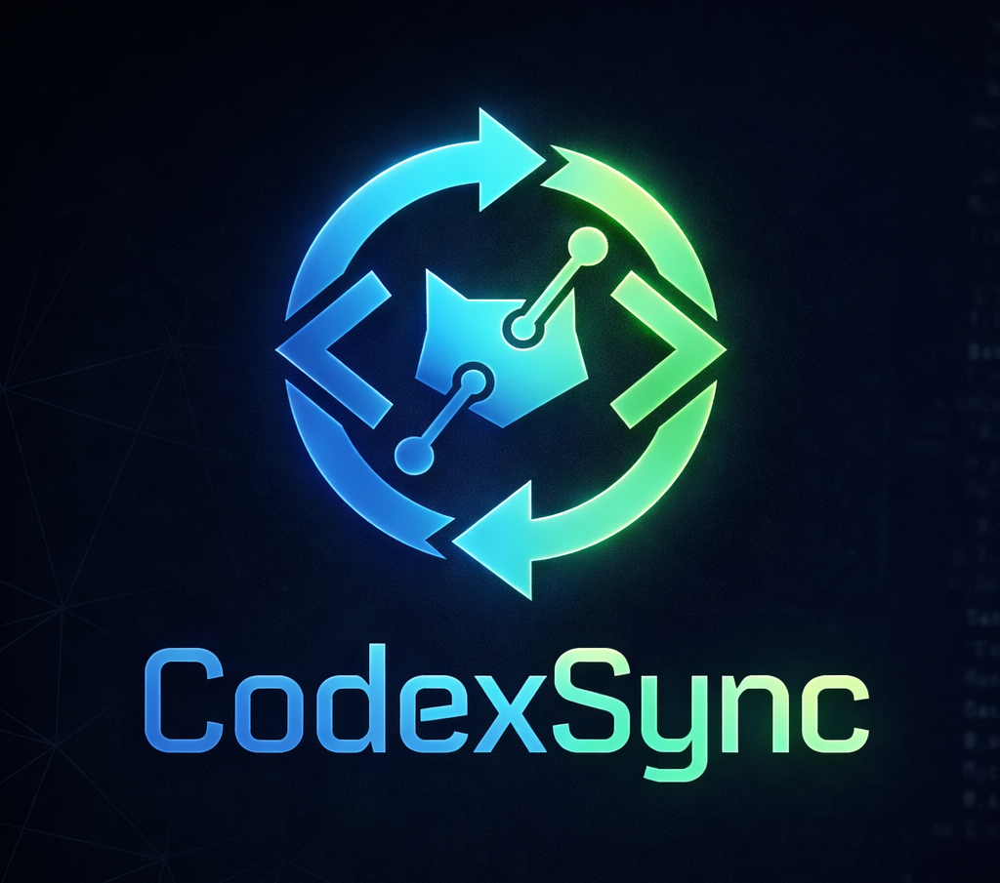

<p align="center">
  
</p>

<h1 align="center">CodexSync</h1>

<p align="center">
  <strong>Auto-sync your LeetCode & GeeksforGeeks solutions to GitHub — zero effort.</strong>
</p>

<p align="center">
  
  
  
  
  
  
</p>

<p align="center">
  <a href="#-features">Features</a>&nbsp;&nbsp;•&nbsp;&nbsp;
  <a href="#-tech-stack">Tech Stack</a>&nbsp;&nbsp;•&nbsp;&nbsp;
  <a href="#-architecture">Architecture</a>&nbsp;&nbsp;•&nbsp;&nbsp;
  <a href="#%EF%B8%8F-installation">Installation</a>&nbsp;&nbsp;•&nbsp;&nbsp;
  <a href="#-setup">Setup</a>&nbsp;&nbsp;•&nbsp;&nbsp;
  <a href="#-creator">Creator</a>
</p>

---

## ⚡ The Problem

Developers solve hundreds of problems on LeetCode and GeeksforGeeks but rarely maintain a structured repository. Manual uploading is slow, repetitive, and error-prone.

## 💡 The Solution

**CodexSync** is a Chrome Extension that detects accepted submissions in real-time and automatically pushes them to your GitHub repository — organized by platform, with metadata headers and proper folder structure.

```
Solve → Submit → Accepted → ✅ Synced to GitHub
```

No copy-pasting. No manual commits. No friction.

---

## ✨ Features

| Feature | Description |
|---------|-------------|
| **🔄 Auto-Sync** | Accepted submissions are pushed to GitHub automatically via background service worker |
| **🌐 Multi-Platform** | LeetCode + GeeksforGeeks with real-time DOM detection |
| **📂 Organized Repos** | Solutions sorted into `LeetCode/` and `GeeksforGeeks/` folders automatically |
| **🔐 GitHub OAuth** | Secure authentication — no passwords stored, token-based flow |
| **🔔 Toast Notifications** | Green checkmark popup confirms every successful sync on the page |
| **🔥 Streak Tracking** | Track your daily solve streak with levels and stats |
| **📜 Sync History** | View recent syncs with status, language, difficulty, and timestamps |
| **🌙 Dark UI** | Premium dark theme built entirely with Tailwind CSS |
| **⚙️ Auto-Sync Toggle** | Enable/disable syncing from the extension popup |
| **💬 Code Headers** | Every file includes problem title, difficulty, source, language metadata |

---

### 📂 Repository Structure (Auto-Generated)

```
your-github-repo/
├── LeetCode/
│   ├── two-sum/
│   │   └── solution.java
│   ├── binary-search/
│   │   └── solution.cpp
│   └── valid-parentheses/
│       └── solution.py
│
└── GeeksforGeeks/
    ├── reverse-a-linked-list/
    │   └── solution.java
    └── detect-cycle-in-a-graph/
        └── solution.cpp
```

Each solution file includes a metadata header:

```java
// Problem: Two Sum
// Difficulty: Easy
// Source: LeetCode
// Language: Java
// Synced by CodexSync
```

---

### 💻 Language Support

Java • C++ • Python • Python3 • JavaScript • TypeScript • Go • Rust • Kotlin • Swift • C • C# • Ruby • PHP • Scala • Dart • Erlang • Elixir • Racket

---

## 🛠 Tech Stack

| Layer | Technology |
|-------|-----------|
| **UI Framework** | React 18 (JSX, no TypeScript) |
| **Styling** | Tailwind CSS 3.4 |
| **Build Tool** | Vite 5 + custom multi-target `build.js` |
| **HTTP Client** | Axios + Fetch API |
| **Extension API** | Chrome Extension Manifest V3 |
| **Auth** | GitHub OAuth (Authorization Code Flow) |
| **Storage** | Chrome Storage API (`sync` + `local`) |
| **GitHub Integration** | GitHub REST API (Contents API) |
| **Data Fetching** | LeetCode GraphQL API |

> **Zero TypeScript. Zero Webpack. Zero CRACO. Zero Chakra UI.**
> Pure JavaScript ES6+ with JSX — clean and lightweight.

---

## 🧠 Architecture

```
┌─────────────────────────────────────────────────────────────┐
│                    Chrome Extension (MV3)                    │
├─────────────────────────────────────────────────────────────┤
│                                                             │
│  ┌──────────────┐   ┌──────────────┐   ┌──────────────┐   │
│  │  LeetCode    │   │    GFG       │   │  GitHub      │   │
│  │  Content     │   │  Content     │   │  Auth        │   │
│  │  Script      │   │  Script      │   │  Script      │   │
│  └──────┬───────┘   └──────┬───────┘   └──────────────┘   │
│         │                  │                               │
│         │  chrome.runtime.sendMessage                      │
│         ▼                  ▼                               │
│  ┌─────────────────────────────────────┐                   │
│  │     Background Service Worker       │                   │
│  │  ┌─────────────────────────────┐    │                   │
│  │  │      GithubHandler.js       │    │                   │
│  │  │  • OAuth Token Management   │    │                   │
│  │  │  • GitHub REST API Calls    │    │                   │
│  │  │  • File Upload (PUT)        │    │                   │
│  │  │  • Path Encoding            │    │                   │
│  │  │  • Sync History Tracking    │    │                   │
│  │  └─────────────────────────────┘    │                   │
│  └─────────────────────────────────────┘                   │
│                        │                                    │
│                        ▼                                    │
│  ┌─────────────────────────────────────┐                   │
│  │        React Popup UI               │                   │
│  │  Onboarding → Dashboard → Settings  │                   │
│  └─────────────────────────────────────┘                   │
│                                                             │
└─────────────────────────────────────────────────────────────┘
                         │
                         ▼
              ┌─────────────────────┐
              │   GitHub REST API   │
              │   api.github.com    │
              └─────────────────────┘
```

### Why Background Service Worker?

Content scripts run in the context of web pages (`leetcode.com`, `geeksforgeeks.org`) and **cannot** make cross-origin requests to `api.github.com` due to CORS. All GitHub API calls are routed through the background service worker which has `host_permissions`.

### Build System

Custom `build.js` orchestrates a **multi-target Vite build**:

| # | Target | Format | Output |
|---|--------|--------|--------|
| 1 | Popup | ESM | `index.html` + JS + CSS |
| 2 | Background | IIFE | `scripts/background.js` |
| 3 | LeetCode | IIFE | `scripts/leetcode.js` |
| 4 | GeeksforGeeks | IIFE | `scripts/geeksforgeeks.js` |
| 5 | AuthorizeGithub | IIFE | `scripts/authorizeGithub.js` |

---

## 📁 Project Structure

```
CodexSync/
├── public/
│   ├── manifest.json          # Chrome Extension Manifest V3
│   ├── index.html             # Popup entry point
│   └── logo192.png            # Extension icon
│
├── src/
│   ├── App.jsx                # Root component
│   ├── config.js              # OAuth credentials
│   ├── constants.js           # App constants
│   │
│   ├── api/
│   │   └── submissions.js     # LeetCode GraphQL queries
│   │
│   ├── components/
│   │   ├── WelcomeScreen.jsx  # Onboarding step 1
│   │   ├── AuthGithub.jsx     # GitHub OAuth flow
│   │   ├── AuthLeetCode.jsx   # LeetCode session check
│   │   ├── SelectRepo.jsx     # Repository picker
│   │   ├── Dashboard.jsx      # Main dashboard view
│   │   ├── SyncHistory.jsx    # Recent sync list
│   │   ├── AutoSyncToggle.jsx # Enable/disable toggle
│   │   ├── GithubCard.jsx     # GitHub profile card
│   │   ├── StatusIndicator.jsx# Connection status dot
│   │   ├── SettingsPanel.jsx  # Settings gear menu
│   │   ├── ErrorMessage.jsx   # Error display
│   │   ├── Logo.jsx           # App logo
│   │   ├── Footer.jsx         # Footer with credits
│   │   └── OnboardingLayout.jsx
│   │
│   ├── handlers/
│   │   ├── githubHandler.js   # GitHub API — upload, auth, path encoding
│   │   ├── leetcodeHandler.js # LeetCode submission parser + GraphQL
│   │   └── geeksforgeeksHandler.js  # GFG DOM scraper + code extraction
│   │
│   ├── scripts/
│   │   ├── background.js      # MV3 service worker — routes all API calls
│   │   ├── leetcode.js        # Content script — detects accepted on LC
│   │   ├── geeksforgeeks.js   # Content script — detects accepted on GFG
│   │   └── authorizeGithub.js # OAuth callback handler on github.com
│   │
│   ├── pages/
│   │   └── popup.jsx          # Popup state machine (onboarding → dashboard)
│   │
│   └── utils/
│       ├── streak.helper.js   # Streak calculation logic
│       └── string-manipulation.helper.js
│
├── build.js                   # Multi-target Vite build orchestrator
├── vite.config.js             # Vite configuration
├── tailwind.config.js         # Tailwind configuration
├── postcss.config.js          # PostCSS configuration
└── package.json
```

---

## ⚙️ Installation

### Prerequisites

- **Node.js** 18+ and **npm**
- **Google Chrome** browser
- **GitHub account** with a repository for storing solutions

### 1. Clone & Install

```bash
git clone https://github.com/premhazra/CodexSync.git
cd CodexSync
npm install
```

### 2. Configure OAuth

Create a local env file from the example:

```bash
cp .env.example .env.local
```

Add your [GitHub OAuth App](https://github.com/settings/developers) credentials:

```env
VITE_GITHUB_CLIENT_ID=your_github_client_id
VITE_GITHUB_CLIENT_SECRET=your_github_client_secret
VITE_GITHUB_REDIRECT_URI=https://github.com/?referrer=codexsync
```

> **GitHub OAuth App settings:**
> - **Homepage URL:** `https://github.com/premhazra/CodexSync`
> - **Authorization callback URL:** `https://github.com/?referrer=codexsync`

### 3. Build

```bash
npm run build
```

### 4. Load in Chrome

1. Navigate to `chrome://extensions`
2. Enable **Developer Mode** (toggle in the top right)
3. Click **Load unpacked**
4. Select the `dist/` folder

---

## 🚀 Setup

1. **Click** the CodexSync extension icon in Chrome toolbar
2. **Authenticate** with GitHub via OAuth
3. **Verify** LeetCode session (must be logged in on leetcode.com)
4. **Select** your target GitHub repository
5. **Done** — CodexSync auto-syncs every accepted submission from now on

### How Detection Works

**LeetCode:**
- `MutationObserver` watches for "Accepted" status appearing in DOM
- URL polling (1s interval) detects SPA navigation changes
- Fetches submission details via LeetCode GraphQL API
- Falls back to slug-based `questionSubmissionList` query if submission ID isn't in URL

**GeeksforGeeks:**
- `MutationObserver` + submit button click hooks with delayed checks
- Scans `document.body.innerText` for "Problem Solved Successfully"
- Multiple retry delays (3s, 5s, 8s, 12s) after submit click
- Extracts code from CodeMirror 5/6, Monaco, or Ace editors

---

## 🔒 Security

- GitHub tokens stored in `chrome.storage.sync` (encrypted by Chrome)
- No passwords are ever stored or transmitted
- OAuth follows standard Authorization Code flow
- All GitHub API calls happen in the sandboxed background service worker
- Extension only activates on `leetcode.com/problems/*` and `geeksforgeeks.org/problems/*`
- Minimal permissions — only what's required

---

## 👨‍💻 Creator

<table>
  <tr>
    <td align="center">
      <a href="https://github.com/premhazra">
        
        <br />
        <sub><b>Prem Hazra</b></sub>
      </a>
      <br />
      <sub>Creator & Developer</sub>
    </td>
  </tr>
</table>

---

## 🎯 Vision

> **Developers should focus on solving problems — not managing repositories.**

CodexSync exists so your GitHub stays updated while you stay focused on what matters — learning and growing as a developer.

---

## 🤝 Contributing

Contributions are welcome! Feel free to open issues or submit pull requests.

1. Fork the repository
2. Create your feature branch (`git checkout -b feature/amazing-feature`)
3. Commit your changes (`git commit -m 'Add amazing feature'`)
4. Push to the branch (`git push origin feature/amazing-feature`)
5. Open a Pull Request

---

## 📄 License

This project is licensed under the [MIT License](LICENSE).

---

<p align="center">
  <strong>CodexSync</strong> — Your coding portfolio, built automatically.
  <br /><br />
  ⭐ Star this repo if CodexSync saved you time
</p>
